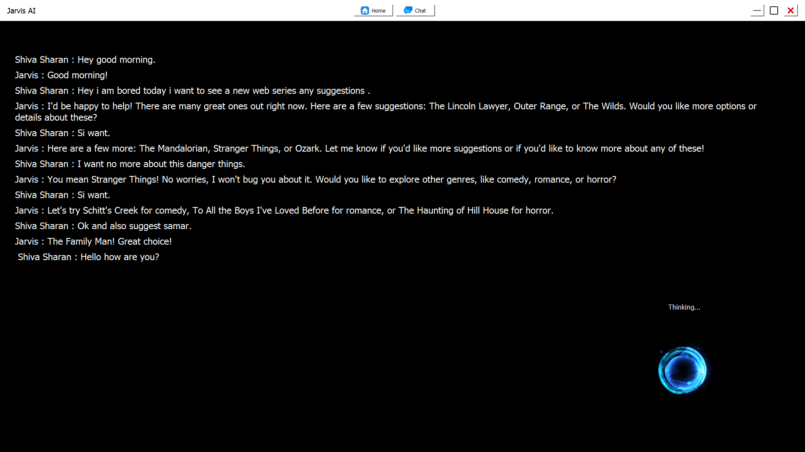

# Jarvis AI

Jarvis AI is a simple voice-driven desktop assistant: speak a request, it listens, decides the intent, fetches info or performs tasks, replies (and speaks) back, and shows the conversation in a minimal GUI.

## Features
- Voice recognition → text
- Smart intent routing (chat, real‑time search, automation, image generation)
- Conversational memory (JSON chat log)
- Text-to-speech responses
- Basic task automation (open/close/play/search commands)
- Optional image generation trigger
- Lightweight GUI with status feedback

## Quick Start
```powershell
pip install -r Requirements.txt
```
Create `.env`:
```
Username=YourName
Assistantname=Jarvis
```
Run:
```powershell
python Main.py
```

## Screenshots
| Chat View | Home View |
|-----------|-----------|
|  |  |

## Structure (Short)
```
Main.py
Backend/ (logic: speech, model, search, automation, tts, images)
Frontend/ (GUI + temp files)
Data/ChatLog.json
```

## Config Notes
`.env` sets display names. `Data/ChatLog.json` keeps history. Image generation writes a flag to `Frontend/Files/ImageGeneration.data`.

## License
Add a license (e.g., MIT) here.

## Caution
Automation can run system tasks; review `Backend/Automation.py` before enabling everywhere.

---
Minimal README version. For more detail restore the previous revision if needed.
